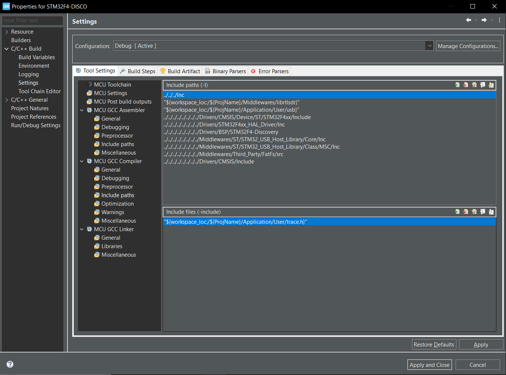

# Projet-3A-SDR

Contributors :
* Thomas Aussagues
* Arthur Docquois
* Aurélien Gossse 
* Selman Sezguin

## Installation de la partie STM32

### Cette partie s'adresse aux personnes voulant importer le projet sur carte STM32F407G. 
Dans un premier temps, démarrez le projet sur STM32CubeIDE en partant du code example ST qui utilise les librairies USB : FatFs_USBDisk. Localisez aussi son emplacement sur votre disque.

Une fois le projet crée, remplacez le dossier User par celui du dépôt. 
Ajoutez le dossier librtlsdr dans le dossier middlewares du projet.
Remplacez le fichier usbh_diskio_dma.h, se trouvant dans Middlewares/FatFs/Drivers par celui présent dans le dépôt. 

Allez à l'emplacement du dossier example FatFs_USBDisk, dans le dossier Inc, remplacez tous les fichiers présents par les fichiers du dossier Inc du dépôt.

Finalement, nous allons inclure dans le compilateur les librairies à ajouter. Clic droit sur le projet > Properties > C/C++ build > Settings > MCU GCC Compiler > include paths. Ajoutez-y les dossiers librtlsdr de Middlewares et usb de User. Vous devriez obtenir la configuration suivante : 

L'ajout de la trace dans les includes n'est pas obligatoire. 
